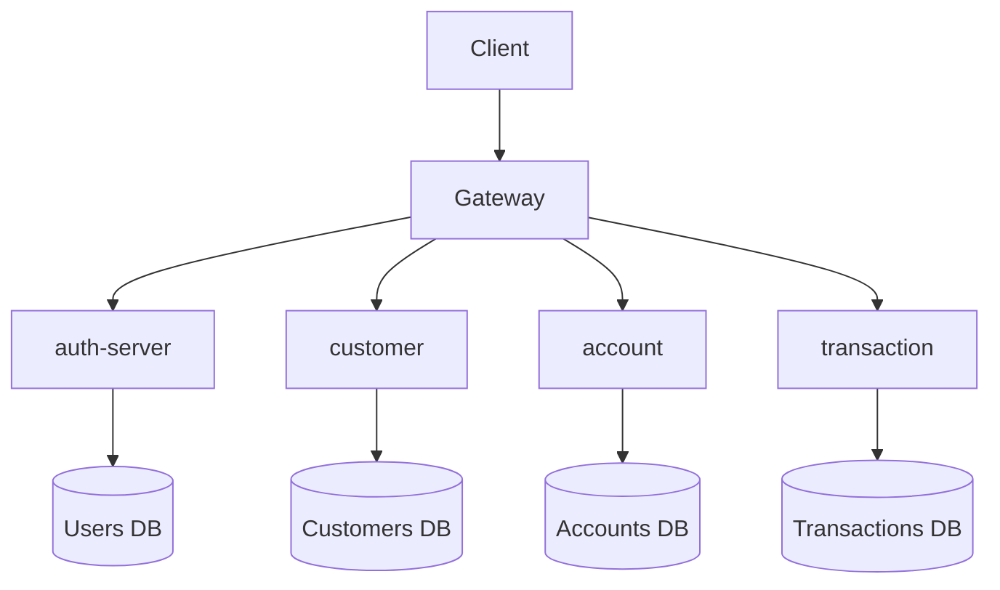
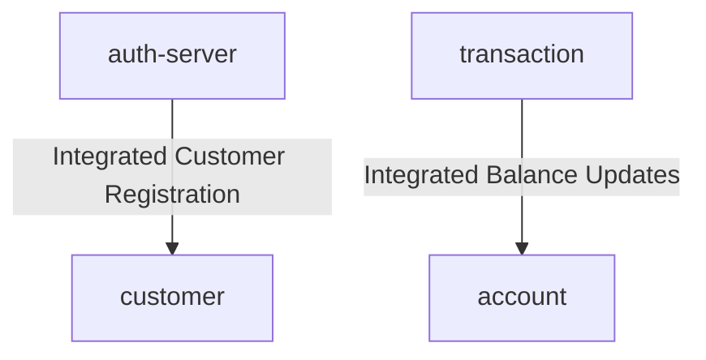
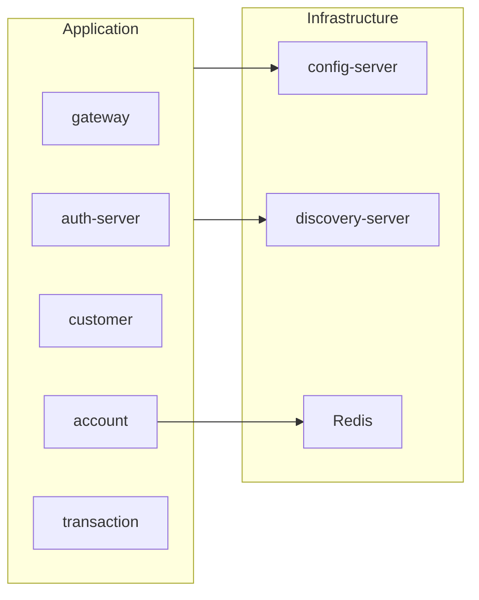

# Amerbank - Java Spring Banking System


## Amerbank is an open-source online banking system built with Java 21 and Spring Boot 3, following a microservices architecture.

It is designed to simulate a real-world banking platform, supporting core financial operations such as account
management, transactions, and secure authentication. The system focuses on scalability, security, and modular design,
leveraging modern cloud-native patterns and distributed systems principles.

This project aims to demonstrate how to build production-grade software using best practices such as RESTful APIs,
JWT-based authentication, service discovery, centralized configuration, and inter-service communication.


##  Quick Start

```bash
git clone https://github.com/Lfav07/amerbank-micro
cd amerbank-micro
docker-compose up --build
```

Access the API Gateway at:
http://localhost:8080

## Table of Contents

- [Architecture](#architecture)
- [Design Decisions](#design-decisions)
- [Application Flow](#application-flow)
- [Service Integration Flow](#service-integration-flow)
- [Infrastructure Overview](#infrastructure-overview)
- [Services](#services)
- [Security](#security)
- [Technologies](#technologies)
- [Features](#features)
- [Running the Project](#running-the-project)
- [API Testing](#api-testing)
- [Kubernetes](#kubernetes)
- [Detailed Service Documentation](#detailed-service-documentation)
- [Future Improvements](#future-improvements)


##  Architecture

Amerbank follows a microservices architecture where each service is responsible for a specific business domain.

Key components include:

- API Gateway - single entry point for all client requests
- Auth Server - handles user and customer registration, authentication and JWT issuance
- Account Service - manages bank accounts
- Transaction Service — processes transfers and operations
- Config Server — centralized configuration management
- Discovery Server — service registration and lookup
## Design Decisions

- **Microservices Architecture**
  The system is split into independent services to improve scalability, maintainability, and fault isolation.

- **API Gateway**  
  A single entry point simplifies routing, security, and cross-cutting concerns.

- **JWT Authentication**  
  Stateless authentication was chosen to enable scalability and reduce server-side session management.

- **Database per Service**
  Each service owns its database to ensure loose coupling and independence.

- **Centralized Configuration**  
  Config Server allows dynamic configuration changes without redeployment.

- **Service Discovery**  
  Eureka enables dynamic service registration and load-balanced communication.

##  Application Flow

The following diagram represents the high-level request flow of the system.

All client requests are routed through the API Gateway, which acts as a single entry point. The gateway is responsible
for forwarding requests to the appropriate microservice, such as authentication, customer, account, or transaction
services.

Each microservice handles its own domain logic and maintains an independent database, ensuring loose coupling and
scalability.

Protected endpoints require a valid JWT issued by the Auth Server.

For detailed execution flows, refer to each microservice's README.



##  Request Flow Example

1. Client sends request to API Gateway
2. Gateway validates JWT token
3. Gateway routes request to the appropriate service
4. Service processes the request
5. Response is returned to the client

##  Service Integration Flow

Some operations require communication between microservices to maintain data consistency.

- The Auth Server integrates with the Customer Service to create a customer profile during user registration.
- The Transaction Service interacts with the Account Service to update balances after transactions.

These interactions are currently implemented using synchronous REST communication.



##  Infrastructure Overview

The system relies on several infrastructure components to support configuration, service discovery, and caching.

- Config Server provides centralized configuration for all services
- Discovery Server enables service registration and dynamic lookup
- Redis is used by the account service for caching account data.

All services fetch configuration from the Config Server and register themselves with the Discovery Server.



## Services

### API Gateway

Acts as the single entry point for all client requests. Responsible for routing and JWT validation.

### Auth Server

Handles user authentication, registration, and JWT token issuance.

### Config Server

Acts as the central configuration hub, providing configurations for local development and Docker environments

### Discovery Server

Responsible for service registration and discovery.

### Customer Service

Manages customer data and profiles.

### Account Service

Responsible for managing bank accounts and balances.

### Transaction Service

Processes financial transactions and ensures consistency.

## Security

Authentication is implemented using JWT (JSON Web Tokens). The Auth Server is responsible for issuing tokens, which are
then validated at the API Gateway.

Security features include:

- Stateless authentication using access tokens
- Token validation at the API Gateway
- Password encryption
- Role-based access control

## Technologies

- Java 21
- Spring Boot 3
- Spring Security
- Spring Cloud (Gateway, Config Server, Eureka)
- PostgreSQL
- Redis
- Docker
- Kubernetes
- Flyway
- JUnit 5
- Testcontainers
- GitHub Actions

## Features

- User registration and authentication
- Customer registration
- Account creation and management
- Money transfers between accounts
- Transaction history
- Secure API access using JWT
- Centralized configuration
- CI/CD pipelines with GitHub Actions
- Database migration with Flyway
- Account data caching with Redis
- Unit and integration tests built with JUnit 5 + Testcontainers
- Full system containerization with Docker

## Running the Project

### Prerequisites

- Docker
- Java 21
- PostgreSQL 15+ (Optional, Required for running locally without docker compose)

### Environment Variables

#### This section is optional if you are running with Docker compose. docker-compose.yml has preconfigured default values to bootstrap the application.

Create a `.env` file or set these environment variables:

```bash
DB_USERNAME=your_db_username
DB_PASSWORD=your_db_password
JWT_SECRET=your_256_bit_minimum_secret_key
```

### Steps

1. Clone the repository
2. Configure environment variables

#### Docker:

Run the system using Docker

```bash
docker-compose up --build
```

#### Running Locally

* Ensure PostgreSQL is running and has the database "amerbank" created.
* Account Microservice Requires a Redis DB instance up on port 6379.

Start the services manually by following the recommended order:

1. Config Server
2. Discovery Server
3. API Gateway
4. Auth Server
5. Customer Service
6. Account Service
7. Transaction Service

## API Testing

### Swagger
 -  Before accessing the swagger endpoint, make sure the desired service is running.
#### The project API's are fully documented and compatible with Swagger OpenAPI.
* [Auth Server Swagger UI](http://localhost:8081/swagger-ui/index.html#/)
* [Customer Service Swagger UI](http://localhost:8082/swagger-ui/index.html#/)
* [Account Service  Swagger UI](http://localhost:8083/swagger-ui/index.html#/)
* [Transaction Service Swagger UI](http://localhost:8084/swagger-ui/index.html#/)
### Postman Collection

The application contains a ready-to-use postman collection exported as JSON, the following steps shows how to import it:

1. Open Postman
2. Click **Import** → **File** → **Upload Files**
3. Select `Amerbank.postman_collection.json` from the root directory
4. Click **Import**

The collection includes requests for all available endpoints. Make sure the application is running before testing.

## Kubernetes

Amerbank can be deployed to Kubernetes using the manifests in the `k8s/` directory. This setup uses Minikube for local development.

For detailed quickstart instructions, see [KUBERNETES.md](./KUBERNETES.md).

# Detailed Service Documentation

Each Amerbank microservice has its own README, with detailed architectural and API documentation specific to the
service.

* [Config Server Documentation](./services/config-server/README.md)
* [Discovery Server Documentation](./services/discovery/README.md)
* [API Gateway Documentation](./services/gateway/README.md)
* [Auth Server Documentation](/services/auth-server/README.md)
* [Customer Service Documentation](./services/customer/README.md)
* [Account Service Documentation](./services/account/README.md)
* [Transaction Service Documentation](./services/transaction/README.md)

##  Future Improvements

- Implement distributed tracing
- Introduce event-driven communication (Kafka)
- Add rate limiting and Resilience at the API Gateway
- Improve monitoring and logging
- Implement the loan microservice


