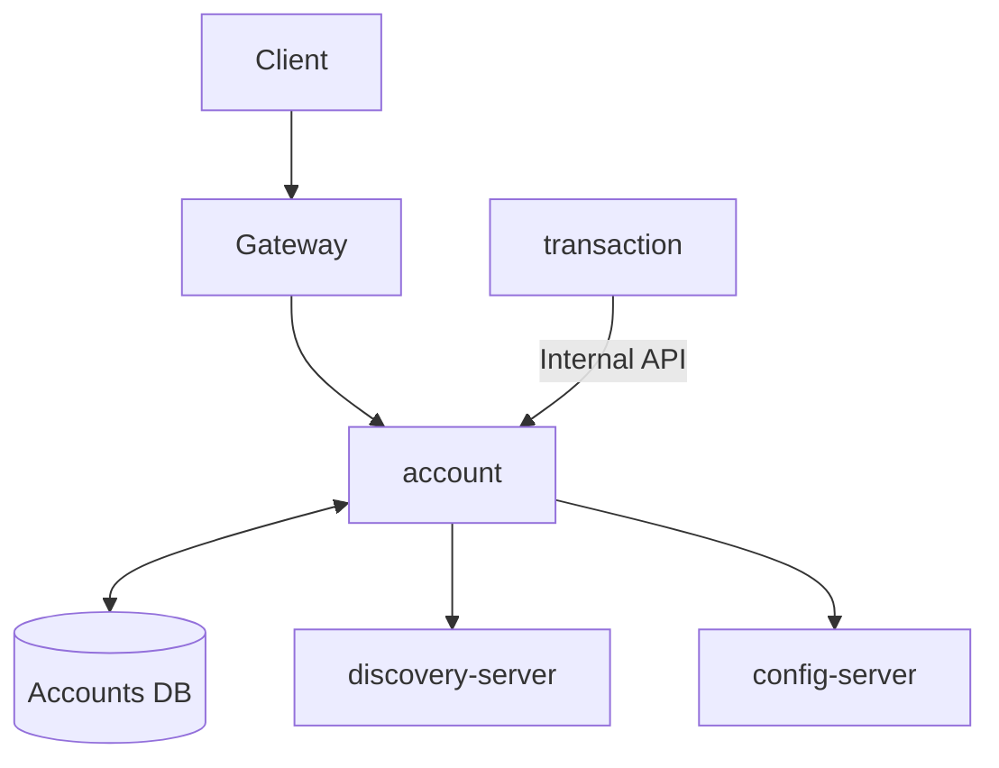

# Account Service

[](https://openjdk.org/)
[](https://spring.io/projects/spring-boot)
[](https://www.postgresql.org/)
[](https://redis.io/)

Bank account management microservice for the Amerbank banking platform.

## Overview

The Account Service handles bank account registration, account information management,
and balance operations for the Amerbank microservices architecture. It integrates with
the transaction-service to process deposits, payments, and refunds.



This diagram represents interactions with the Account Service and Transaction Service.

Only requests targeting account endpoints are routed to this service. All balance operations
(deposit, payment, refund) are initiated through the transaction-service, which internally
calls the account-service.

**Flow:**

1. Client authenticates via `/auth/login`
2. Auth Server returns a JWT token
3. For account operations: Client calls account-service directly
4. For balance operations: Client calls transaction-service, which calls account-service internally

**Account Service is used by:**

- **transaction-service**: For balance operations (deposit, payment, refund)

## Features

- Role-based access control (ROLE_USER, ROLE_ADMIN)
- Self-service account registration and retrieval
- Account types: CHECKING, SAVINGS, BUSINESS
- Account status: ACTIVE, SUSPENDED, CLOSED
- Balance inquiry and management
- Redis caching for account data
- Admin account management (CRUD operations)
- Service-to-service authentication for internal microservices

## Technology Stack

| Category          | Technology                        |
|-------------------|-----------------------------------|
| Framework         | Spring Boot 3.4.4                 |
| Language          | Java 21                           |
| Database          | PostgreSQL with Flyway migrations |
| Cache             | Redis                             |
| Security          | Spring Security + JWT (jjwt)      |
| Service Discovery | Eureka Client                     |
| Configuration     | Spring Cloud Config               |
| Testing           | JUnit 5, Mockito, Testcontainers  |

## Getting Started

### Prerequisites

- Java 21
- PostgreSQL (create database named `amerbank`)
- Redis (for caching)
- Docker (optional)

### Environment Variables

Create a `.env` file or set these environment variables:

```bash
DB_USERNAME=your_db_username
DB_PASSWORD=your_db_password
JWT_SECRET=your_256_bit_minimum_secret_key
```

### Running the System

#### Local Development

1. Set `amerbank-micro` as your current directory

2. Start the infrastructure services:
   ```bash
   docker-compose up config-server discovery-server redis
   ```

3. Create the `amerbank` database in PostgreSQL

4. Set `account` as your current directory

5. Run migrations:
   ```bash
   ./mvnw flyway:migrate
   ```

6. Start the application:
   ```bash
   ./mvnw spring-boot:run
   ```

The service runs on **port 8083**.

#### Docker Deployment

From the project root, run:

```bash
docker-compose up
```

This starts all services (config-server, discovery-server, account-service, and other microservices) with pre-configured
settings.

## Authentication

To access protected endpoints:

1. Obtain a JWT via `/auth/login` on auth-server
2. Include it in the Authorization header:
   ```
   Authorization: Bearer <token>
   ```

**Roles:**

- `ROLE_USER` - Standard customer access (view own accounts, register accounts)
- `ROLE_ADMIN` - Administrative access (full account management)

**Internal Services:**
Internal service-to-service calls must include the `SCOPE_service` claim in the JWT.

## API Endpoints

### Protected Endpoints (User)

| Method | Endpoint                | Description                       |
|--------|-------------------------|-----------------------------------|
| POST   | `/account/register`     | Register a new account            |
| GET    | `/account/me`           | Get all accounts for current user |
| GET    | `/account/me/type`      | Get account by type               |
| POST   | `/account/me/owned`     | Check account ownership           |
| GET    | `/account/me/balances`  | Get all account balances          |
| GET    | `/account/me/balance`   | Get balance by account type       |
| GET    | `/account/me/has-funds` | Check sufficient funds            |

### Protected Endpoints (Admin)

| Method | Endpoint                                     | Description                      |
|--------|----------------------------------------------|----------------------------------|
| GET    | `/account/admin/customers/{customerId}`      | Get all accounts for a customer  |
| GET    | `/account/admin/customers/{customerId}/type` | Get account by customer and type |
| GET    | `/account/admin/{accountNumber}`             | Get account by account number    |
| PUT    | `/account/admin/{accountNumber}/type`        | Update account type              |
| PUT    | `/account/admin/{accountNumber}/status`      | Update account status            |
| PUT    | `/account/admin/{accountNumber}/suspend`     | Suspend account                  |
| DELETE | `/account/admin/{accountNumber}`             | Delete account                   |
| GET    | `/account/admin/{accountNumber}/active`      | Check if account is active       |
| GET    | `/account/admin/{accountNumber}/balance`     | Get account balance              |

### Internal Endpoints (Service-to-Service)

| Method | Endpoint                    | Description                                     |
|--------|-----------------------------|-------------------------------------------------|
| POST   | `/account/internal/owned`   | Check account ownership                         |
| POST   | `/account/internal/deposit` | Deposit funds (called by transaction-service)   |
| POST   | `/account/internal/payment` | Process payment (called by transaction-service) |
| POST   | `/account/internal/refund`  | Process refund (called by transaction-service)  |

## Health Check

| Method | Endpoint           | Description           |
|--------|--------------------|-----------------------|
| GET    | `/actuator/health` | Service health status |

## Example Requests & Responses

### Register Account

**Request:**

```bash
curl -X POST http://localhost:8080/account/register \
  -H "Content-Type: application/json" \
  -H "Authorization: Bearer <token>" \
  -d '{
    "type": "CHECKING"
  }'
```

**Response:**

```
Account successfully registered
```

### Get My Accounts

**Request:**

```bash
curl -X GET http://localhost:8080/account/me \
  -H "Authorization: Bearer <token>"
```

**Response:**

```json
[
  {
    "accountNumber": "ACC-XXXX-XXXX-XXXX",
    "type": "CHECKING",
    "status": "ACTIVE",
    "balance": 1000.00
  }
]
```

### Get Account Balance

**Request:**

```bash
curl -X GET "http://localhost:8080/account/me/balance?type=CHECKING" \
  -H "Authorization: Bearer <token>"
```

**Response:**

```json
1000.00
```

### Deposit Funds (via transaction-service)

The deposit flow goes through transaction-service:

**Request:**

```bash
curl -X POST http://localhost:8080/transaction/deposit \
  -H "Content-Type: application/json" \
  -H "Authorization: Bearer <token>" \
  -H "idempotency-key: dep-12345" \
  -d '{
    "accountNumber": "ACC-XXXX-XXXX-XXXX",
    "amount": 500.00
  }'
```

**Response:**

```json
{
  "id": "tx-12345",
  "type": "DEPOSIT",
  "fromAccountNumber": null,
  "toAccountNumber": "ACC-XXXX-XXXX-XXXX",
  "amount": 500.00,
  "status": "APPROVED",
  "createdAt": "2026-02-22T10:30:00"
}
```

## Error Handling

The API returns standard error responses:

```json
{
  "timestamp": "2026-02-21T10:30:00",
  "status": 404,
  "error": "Not Found",
  "message": "Account not found"
}
```

**Common HTTP Status Codes:**
| Status | Description |
|--------|-------------|
| 200 | Success |
| 201 | Created |
| 204 | No Content |
| 400 | Bad Request (validation error) |
| 401 | Unauthorized (invalid credentials) |
| 403 | Forbidden (insufficient permissions) |
| 404 | Not Found |
| 409 | Conflict (account already exists) |
| 500 | Internal Server Error |

## Security

- JWT tokens are validated using HS256 algorithm
- Two authentication chains: customer-facing and service-to-service
- Internal endpoints require `SCOPE_service` claim in JWT
- Role-based access control for user vs admin operations
- Pessimistic locking for balance operations to prevent race conditions

## Testing

```bash
# Run unit tests
./mvnw test

# Run all tests including integration
./mvnw verify

# Run specific test class
./mvnw test -Dtest=AccountServiceTest
```

## Project Structure

```
src/main/java/com/amerbank/account/
├── controller/      # REST endpoints
├── service/        # Business logic
├── model/          # JPA entities
├── dto/            # Data transfer objects
├── repository/     # Data access
├── exception/      # Custom exceptions
├── security/       # JWT, filters, config
├── config/         # Application configuration
└── util/           # Utilities
```

## Related Services

- **auth-server** (port 8081) - Authentication and authorization
- **customer-service** (port 8082) - Customer profile management
- **transaction-service** (port 8084) - Transaction handling
- **gateway** (port 8080) - API Gateway
- **discovery** (port 8761) - Eureka Service Discovery
- **config-server** - Centralized configuration
