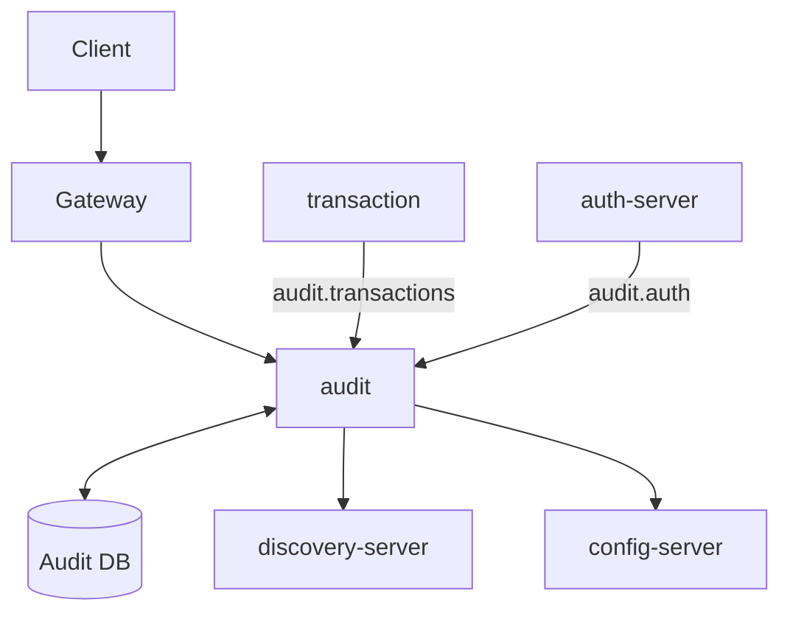

# Audit Logging Service

[](https://openjdk.org/)
[](https://spring.io/projects/spring-boot)
[](https://www.postgresql.org/)
[](https://kafka.apache.org/)

Audit and logging management microservice for the Amerbank banking platform.

## Overview

The Audit Service handles the consumption and persistence of audit events sent by other services.
Currently, it integrates with the **transaction-service** and **auth-server** microservices to process
logs sent from these services. Topics for **account-service** and **customer-service** are already configured
in the consumer for future integration.



Requests are not routed directly through the API Gateway. Instead, services produce audit event
messages to Kafka topics, and the Audit Service consumes them asynchronously.

**Flow:**

1. A service (e.g., transaction-service, auth-server) performs an operation
2. The service produces an `AuditEventMessage` to the appropriate Kafka topic
3. The Audit Service consumes the message via a `@KafkaListener`
4. The event is persisted to the `audit_log` table
5. On failure, the message is retried up to 3 times with 2-second intervals
6. After exhausting retries, the message is routed to a Dead Letter Queue (`<topic>.dlq`)

**Kafka Topics Consumed:**

| Topic               | Source Service        | Status               |
|---------------------|-----------------------|----------------------|
| `audit.transactions` | transaction-service   | Active               |
| `audit.auth`        | auth-server           | Active               |
| `audit.accounts`     | account-service       | Configured (planned) |
| `audit.customers`   | customer-service      | Configured (planned) |

**Audit Service is used by:**

- **transaction-service**: Produces audit events for deposits, payments, and refunds
- **auth-server**: Produces audit events for login, registration, and authentication actions
- **account-service**: *(planned)* Will produce audit events for account lifecycle operations
- **customer-service**: *(planned)* Will produce audit events for customer profile changes

## Features

- Kafka-based asynchronous audit event ingestion
- Dead Letter Queue (DLQ) handling for failed messages
- Configurable retry policy (3 retries, 2s backoff)
- Concurrent consumer processing (concurrency: 8)
- Role-based access control (requires ROLE_ADMIN)
- Paginated search with dynamic filtering (event type, service, actor, entity, status, date range)
- Full event detail retrieval by ID
- PostgreSQL `jsonb` storage for flexible payload data
- Flyway-managed database migrations
- Authentication via JWT
- Swagger/OpenAPI documentation

## Technology Stack

| Category          | Technology                        |
|-------------------|-----------------------------------|
| Framework         | Spring Boot 3.4.13                |
| Language          | Java 21                           |
| Database          | PostgreSQL with Flyway migrations |
| Messaging         | Apache Kafka                      |
| Caching           | Caffeine (available, not in use)  |
| Security          | Spring Security + JWT (jjwt)      |
| Service Discovery | Eureka Client                     |
| Configuration     | Spring Cloud Config               |
| API Docs          | SpringDoc OpenAPI 2.8.15          |
| Testing           | JUnit 5, Mockito, Testcontainers  |

## Getting Started

### Prerequisites

- Java 21
- PostgreSQL (create database named `amerbank`)
- Apache Kafka (or Docker)
- Docker (optional)

### Environment Variables

Create a `.env` file or set these environment variables (not needed when using Docker Compose, as it provides default values):

```bash
DB_USERNAME=your_db_username
DB_PASSWORD=your_db_password
JWT_SECRET=your_256_bit_minimum_secret_key
```

### Running the System

#### Local Development

1. Set `amerbank-micro` as your current directory

2. Start the infrastructure services:
   ```bash
   docker-compose up config-server discovery-server kafka
   ```

3. Create the `amerbank` database in PostgreSQL

4. Set `audit-logging` as your current directory

5. Run migrations:
   ```bash
   ./mvnw flyway:migrate
   ```

6. Start the application:
   ```bash
   ./mvnw spring-boot:run
   ```

The service runs on **port 8085**.

#### Docker Deployment

From the project root, run:

```bash
docker-compose up
```

This starts all services (config-server, discovery-server, audit-logging-service, and other microservices) with pre-configured
settings.

## Authentication

To access protected endpoints:

1. Obtain a JWT via `/auth/login` on auth-server
2. Include it in the Authorization header:
   ```
   Authorization: Bearer <token>
   ```

**Roles:**

- `ROLE_ADMIN` - Administrative access (required for all audit endpoints)

**Note:** Unlike other microservices, the Audit Service does not expose `ROLE_USER`-level endpoints.
All audit operations require administrative privileges.

## API Documentation (Swagger)

This service provides interactive API documentation using **Swagger UI**, allowing you to explore and test endpoints
directly from the browser.

### Access Swagger UI

http://localhost:8085/swagger-ui/index.html#/

---

### Authentication on Swagger

All endpoints require a **JWT token** with `ROLE_ADMIN`.

1. Authenticate using `/auth/login` with admin credentials
2. Copy the returned token
3. Click **Authorize** in Swagger UI
4. Enter the token copied

## API Endpoints

### Protected Endpoints (Admin)

| Method | Endpoint      | Description                              |
|--------|---------------|------------------------------------------|
| GET    | `/audit`      | Search audit events with filters         |
| GET    | `/audit/{id}` | Get full audit event details by UUID     |

### Query Parameters for `/audit`

| Parameter    | Type      | Description                                  |
|--------------|-----------|----------------------------------------------|
| `eventType`  | String    | Filter by event type                         |
| `service`    | String    | Filter by source service name                |
| `actorId`    | String    | Filter by actor/user identifier              |
| `entityId`   | String    | Filter by affected entity identifier         |
| `entityType` | String    | Filter by affected entity type               |
| `status`     | String    | Filter by event status                       |
| `from`       | Instant   | Filter events after this timestamp           |
| `to`         | Instant   | Filter events before this timestamp          |
| `page`       | Integer   | Page number (0-based, default: 0)            |
| `size`       | Integer   | Page size (default: 20)                      |
| `sort`       | String    | Sort property and direction (e.g., `timestamp,desc`) |

## Health Check

| Method | Endpoint           | Description           |
|--------|--------------------|-----------------------|
| GET    | `/actuator/health` | Service health status |

## Example Requests & Responses

### Search Audit Events

**Request:**

```bash
curl -X GET "http://localhost:8080/audit?eventType=LOGIN&service=auth-server&page=0&size=10" \
  -H "Authorization: Bearer <token>"
```

**Response:**

```json
{
  "content": [
    {
      "eventId": "550e8400-e29b-41d4-a716-446655440000",
      "eventType": "LOGIN",
      "timestamp": "2026-02-21T10:30:00Z",
      "service": "auth-server",
      "status": "SUCCESS"
    }
  ],
  "pageable": {
    "pageNumber": 0,
    "pageSize": 10,
    "sort": {
      "sorted": true,
      "unsorted": false,
      "empty": false
    }
  },
  "totalElements": 1,
  "totalPages": 1
}
```

### Get Audit Event by ID

**Request:**

```bash
curl -X GET http://localhost:8080/audit/550e8400-e29b-41d4-a716-446655440000 \
  -H "Authorization: Bearer <token>"
```

**Response:**

```json
{
  "eventId": "550e8400-e29b-41d4-a716-446655440000",
  "eventType": "LOGIN",
  "timestamp": "2026-02-21T10:30:00Z",
  "service": "auth-server",
  "actorId": "user-123",
  "entityId": "cust-456",
  "entityType": "USER",
  "status": "SUCCESS",
  "correlationId": "corr-789",
  "payload": {
  "email": " test@email.com"
  }
}
```

## Error Handling

The API returns standard error responses:

```json
{
  "timestamp": "2026-02-21T10:30:00",
  "status": 404,
  "error": "Not Found",
  "message": "Event not found with id: 550e8400-e29b-41d4-a716-446655440000"
}
```

**Common HTTP Status Codes:**

| Status | Description           |
|--------|-----------------------|
| 200    | Success               |
| 400    | Validation error      |
| 401    | Unauthorized          |
| 403    | Forbidden             |
| 404    | Not found             |
| 500    | Internal server error |

## Security

- JWT tokens are validated using HS256 algorithm
- All endpoints require `ROLE_ADMIN` authority
- Kafka messages are consumed without additional authentication (internal network)
- Dead Letter Queue isolates failed messages for debugging
- CSRF disabled, stateless sessions

## Testing

```bash
# Run unit tests
./mvnw test

# Run all tests including integration
./mvnw verify

# Run specific test class
./mvnw test -Dtest=AuditServiceTest
```

## Project Structure

```
src/main/java/com/amerbank/audit_logging/
├── controller/      # REST endpoints
├── service/         # Business logic + Kafka consumers
├── model/           # JPA entities
├── dto/             # Data transfer objects + enums
├── repository/      # Data access + specification builders
├── exception/       # Custom exceptions
├── security/        # JWT authentication, filters, config
└── config/          # Application configuration
```

## Related Services

- **auth-server** (port 8081) - Authentication and authorization
- **customer-service** (port 8082) - Customer profile management
- **account-service** (port 8083) - Account management
- **transaction-service** (port 8084) - Transaction handling
- **gateway** (port 8080) - API Gateway
- **discovery** (port 8761) - Eureka Service Discovery
- **config-server** - Centralized configuration
- **kafka** - Message broker for audit event ingestion