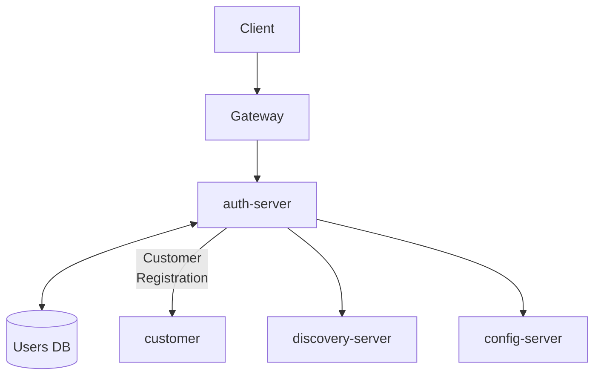

# Auth Server

[](https://openjdk.org/)
[](https://spring.io/projects/spring-boot)
[](https://www.postgresql.org/)

Authentication and authorization microservice for the Amerbank banking platform.

## Overview

The Auth Server handles user registration, login, JWT token generation, and role-based access control for the Amerbank
microservices architecture. It integrates with the customer-service to create customer profiles upon user registration.

## Auth Server Interaction



This diagram represents interactions with the Auth Server.

Only requests targeting auth endpoints (e.g., login, registration, user management)
are routed to this service.

All other requests are routed directly from the gateway to their respective services.

**Flow:**

1. Client authenticates via `/auth/login`
2. Auth Server returns a JWT token
3. All requests go through the gateway
4. Gateway validates the JWT and forwards to appropriate services

**Disclaimer**:
Auth Server is only responsible for issuing JWT tokens.
After authentication, each microservice and the API Gateway independently
validate incoming requests using the JWT. This ensures a stateless
authentication model.

**Auth Server is used by:**

- **customer-service** - for user and customer registration integration

## Features

- User registration and login with JWT authentication
- Role-based access control (ROLE_USER, ROLE_ADMIN)
- Password encryption with BCrypt
- Self-service email and password updates
- Admin user management (CRUD operations)
- Service-to-service authentication for internal microservices

## Technology Stack

| Category          | Technology                        |
|-------------------|-----------------------------------|
| Framework         | Spring Boot 3.4.4                 |
| Language          | Java 21                           |
| Database          | PostgreSQL with Flyway migrations |
| Security          | Spring Security + JWT (jjwt)      |
| Service Discovery | Eureka Client                     |
| Configuration     | Spring Cloud Config               |
| Testing           | JUnit 5, Mockito, Testcontainers  |

## Getting Started

### Prerequisites

- Java 21
- PostgreSQL (create database named `amerbank`)
- Docker (optional)

### Environment Variables

Create a `.env` file or set these environment variables:

```bash
DB_USERNAME=your_db_username
DB_PASSWORD=your_db_password
JWT_SECRET=your_256_bit_minimum_secret_key
```

### Running the System

#### Local Development

1. Set `amerbank-micro` as your current directory

2. Start the infrastructure services with Docker:
   ```bash
   docker-compose up config-server discovery-server
   ```
   Or manually by running the ConfigServerApplication and DiscoveryApplication

3. Create the `amerbank` database in PostgreSQL

4. Set `auth-server` as your current directory

5. Run migrations:
   ```bash
   ./mvnw flyway:migrate
   ```

6. Start the application:
   ```bash
   ./mvnw spring-boot:run
   ```

The service runs on **port 8081**.

#### Docker Deployment

From the project root, run:

```bash
docker-compose up
```

This starts all services (config-server, discovery-server, auth-server, and other microservices) with pre-configured
settings.

## Authentication

To access protected endpoints:

1. Obtain a JWT via `/auth/login` or `/auth/admin/login`
2. Include it in the Authorization header:
   ```
   Authorization: Bearer <token>
   ```

**Roles:**

- `ROLE_USER` - Standard customer access
- `ROLE_ADMIN` - Administrative access

**Internal Services:**
Internal service-to-service calls must include the `SCOPE_service` claim in the JWT.

## API Endpoints

### Public Endpoints

| Method | Endpoint               | Description        |
|--------|------------------------|--------------------|
| POST   | `/auth/login`          | User login         |
| POST   | `/auth/register`       | User registration  |
| POST   | `/auth/admin/login`    | Admin login        |
| POST   | `/auth/admin/register` | Admin registration |

### Protected Endpoints (User)

| Method | Endpoint            | Description           |
|--------|---------------------|-----------------------|
| GET    | `/auth/me`          | Get current user info |
| PATCH  | `/auth/me/email`    | Update own email      |
| PATCH  | `/auth/me/password` | Update own password   |

### Protected Endpoints (Admin)

| Method | Endpoint                          | Description          |
|--------|-----------------------------------|----------------------|
| GET    | `/auth/admin/users`               | List all users       |
| GET    | `/auth/admin/users/{id}`          | Get user by ID       |
| GET    | `/auth/admin/users/by-email`      | Get user by email    |
| PATCH  | `/auth/admin/users/{id}/email`    | Update user email    |
| PATCH  | `/auth/admin/users/{id}/password` | Update user password |
| DELETE | `/auth/admin/users/{id}`          | Delete user          |

### Internal Endpoints (Service-to-Service)

| Method | Endpoint                        | Description       |
|--------|---------------------------------|-------------------|
| GET    | `/auth/internal/users/by-email` | Get user by email |

## Health Check

| Method | Endpoint           | Description           |
|--------|--------------------|-----------------------|
| GET    | `/actuator/health` | Service health status |

## Example Requests & Responses

### Login

**Request:**

```bash
curl -X POST http://localhost:8080/auth/login \
  -H "Content-Type: application/json" \
  -d '{
    "email": "user@example.com",
    "password": "yourpassword"
  }'
```

**Response:**

```json
{
  "token": "eyJhbGciOiJIUzI1NiIsInR5cCI6IkpXVCJ9..."
}
```

### Register

**Request:**

```bash
curl -X POST http://localhost:8080/auth/register \
  -H "Content-Type: application/json" \
  -d '{
    "email": "newuser@example.com",
    "password": "securepassword",
    "firstName": "John",
    "lastName": "Doe",
    "dateOfBirth": "1990-01-15"
  }'
```

**Response:**

```json
{
  "id": 1,
  "customerId": 100,
  "email": "user@example.com"
}
```

### Get Current User

**Request:**

```bash
curl -X GET http://localhost:8080/auth/me \
  -H "Authorization: Bearer <token>"
```

**Response:**

```json
{
  "id": 1,
  "customerId": 100,
  "email": "user@example.com"
}
```

## Error Handling

The API returns standard error responses:

```json
{
  "timestamp": "2026-02-21T10:30:00",
  "status": 404,
  "error": "Not Found",
  "message": "User not found"
}
```

**Common HTTP Status Codes:**
| Status | Description |
|--------|-------------|
| 200 | Success |
| 201 | Created |
| 400 | Bad Request (validation error) |
| 401 | Unauthorized (invalid credentials) |
| 403 | Forbidden (insufficient permissions) |
| 404 | Not Found |
| 409 | Conflict (email already taken) |
| 500 | Internal Server Error |

## Security

- JWT tokens are signed with HS256 algorithm
- Passwords are encrypted using BCrypt
- Two authentication chains: customer-facing and service-to-service
- Internal endpoints require `SCOPE_service` claim in JWT

## Testing

```bash
# Run unit tests
./mvnw test

# Run all tests including integration
./mvnw verify

# Run specific test class
./mvnw test -Dtest=UserServiceTest
```

## Project Structure

```
src/main/java/com/amerbank/auth_server/
├── controller/      # REST endpoints
├── service/        # Business logic
├── model/          # JPA entities
├── dto/            # Data transfer objects
├── repository/     # Data access
├── exception/      # Custom exceptions
├── security/       # JWT, filters, config
├── config/         # Application configuration
└── util/           # Utilities
```

## Related Services

- **customer-service** - Customer profile management
- **account-service** - Bank account management
- **transaction-service** - Transaction handling
- **gateway** - API Gateway
- **discovery** - Eureka Service Discovery
- **config-server** - Centralized configuration
