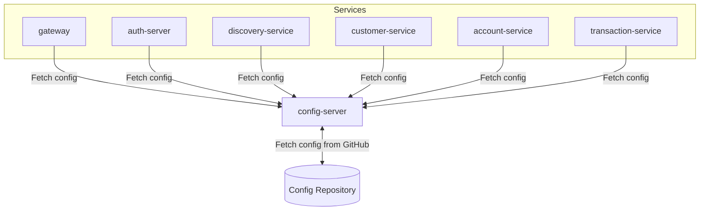

# Config Server

[](https://openjdk.org/)
[](https://spring.io/projects/spring-boot)
[](https://spring.io/projects/spring-cloud)

Centralized configuration management microservice for the Amerbank banking platform.

## Overview

The Config Server provides centralized configuration management using Spring Cloud Config.
All microservices fetch their configuration from this server, which reads from a GitHub
repository. This enables configuration management across all services without deploying
new code.



This diagram shows how all microservices fetch their configuration from the Config Server,
which retrieves configurations from a GitHub repository.

**Flow:**

1. Config Server starts and clones configuration from GitHub repository
2. Each microservice starts and requests its configuration from Config Server
3. Config Server serves configuration based on application name and profile
4. Configuration can be refreshed at runtime using the `/actuator/refresh` endpoint

**Config Server is used by:**

- **All microservices** - For centralized configuration management

## Features

- Spring Cloud Config Server for centralized configuration
- Git backend for version-controlled configurations
- Support for multiple application profiles
- Runtime configuration refresh support
- Encrypted sensitive configuration values

## Technology Stack

| Category          | Technology                 |
|-------------------|----------------------------|
| Framework         | Spring Boot 3.4.4          |
| Language          | Java 21                    |
| Configuration     | Spring Cloud Config Server |
| Backend           | Git (GitHub)               |
| Cloud             | Spring Cloud 2024.0.1      |

## Getting Started

### Prerequisites

- Java 21
- Access to the configuration GitHub repository

### Running the System

#### Local Development
1. Set `amerbank-micro` as your current directory

2. Start the infrastructure services:
   ```bash
   docker-compose up config-server
   ```

3. Set `config-server` as your current directory

4. Start the application:
   ```bash
   ./mvnw spring-boot:run
   ```

The service runs on **port 8888**.

#### Docker Deployment

From the project root, run:

```bash
docker-compose up
```

This starts all services with pre-configured settings.

## Configuration

The Config Server reads configuration from a GitHub repository:

- **Repository**: `git@github.com:Lfav07/amerbank-config.git`
- **Branch**: `main`
- **Path**: `configurations/`

Each service's configuration is stored as `{application name}.yaml` or `{application name}-{profile}.yaml`
in the repository.

## Health Check

| Method | Endpoint | Description |
|--------|----------|-------------|
| GET | `/actuator/health` | Service health status |
| POST | `/actuator/refresh` | Refresh configuration (per service) |

## Related Services

- **gateway** - API Gateway
- **auth-server** (port 8081) - Authentication and authorization
- **customer-service** (port 8082) - Customer profile management
- **account-service** (port 8083) - Account management
- **transaction-service** (port 8084) - Transaction handling
- **discovery-service** (port 8761) - Service discovery
