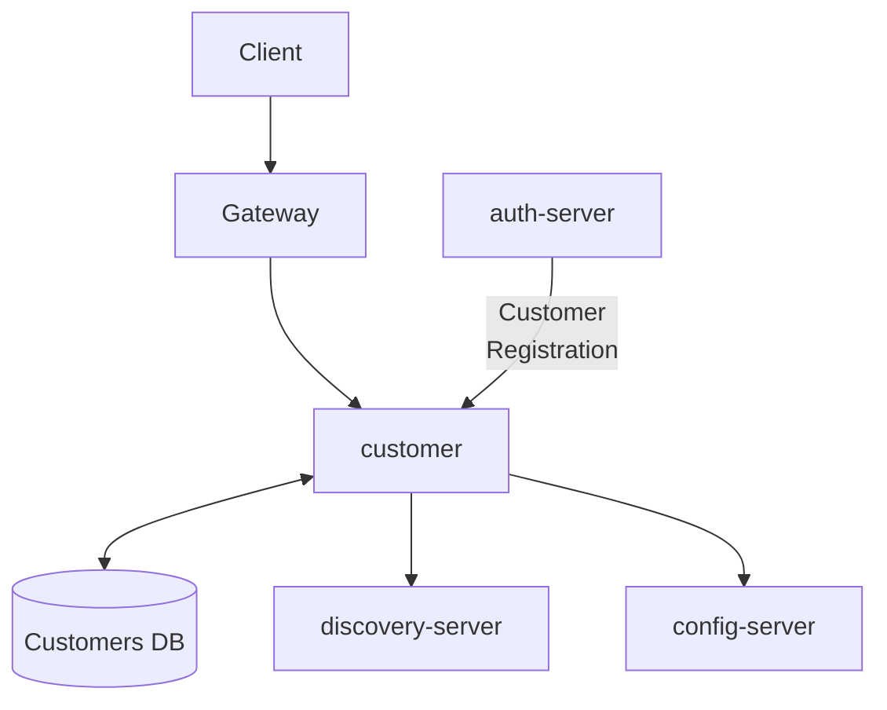
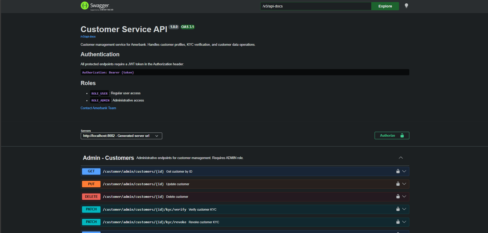

# Customer Service

[](https://openjdk.org/)
[](https://spring.io/projects/spring-boot)
[](https://www.postgresql.org/)

Customer-related data microservice for the Amerbank banking platform.

## Overview

The Customer Service handles customer registration and customer information management
for the Amerbank microservices architecture. The customer registration process is
integrated and orchestrated by auth-server.



This diagram represents interactions with the Customer Service.

Only requests targeting customer endpoints are routed to this service.

All other requests are routed directly from the gateway to their respective services.

**Flow:**

1. Client authenticates via `/auth/login`
2. Auth Server returns a JWT token
3. All requests go through the gateway
4. Gateway validates the JWT and forwards to customer service

**Customer Service is used by:**

- **auth-server**: for customer registration integration

## Features

- Role-based access control (ROLE_USER, ROLE_ADMIN)
- Self-service customer data retrieval
- Admin customer management (CRUD operations)
- Service-to-service authentication for internal microservices

## Technology Stack

| Category          | Technology                        |
|-------------------|-----------------------------------|
| Framework         | Spring Boot 3.4.4                 |
| Language          | Java 21                           |
| Database          | PostgreSQL with Flyway migrations |
| Security          | Spring Security + JWT (jjwt)      |
| Service Discovery | Eureka Client                     |
| Configuration     | Spring Cloud Config               |
| Testing           | JUnit 5, Mockito, Testcontainers  |

## Getting Started

### Prerequisites

- Java 21
- PostgreSQL (create database named `amerbank`)
- Docker (optional)

### Environment Variables

Create a `.env` file or set these environment variables:

```bash
DB_USERNAME=your_db_username
DB_PASSWORD=your_db_password
JWT_SECRET=your_256_bit_minimum_secret_key
```

### Running the System

#### Local Development

1. Set `amerbank-micro` as your current directory

2. Start the infrastructure services:
   ```bash
   docker-compose up config-server discovery-server
   ```

3. Create the `amerbank` database in PostgreSQL

4. Set `customer` as your current directory

5. Run migrations:
   ```bash
   ./mvnw flyway:migrate
   ```

6. Start the application:
   ```bash
   ./mvnw spring-boot:run
   ```

The service runs on **port 8082**.

#### Docker Deployment

From the project root, run:

```bash
docker-compose up
```

This starts all services (config-server, discovery-server, customer-service, and other microservices) with
pre-configured settings.

## Authentication

To access protected endpoints:

1. Obtain a JWT via `/auth/login` on auth-server
2. Include it in the Authorization header:
   ```
   Authorization: Bearer <token>
   ```

**Roles:**

- `ROLE_USER` - Standard customer access (view own profile)
- `ROLE_ADMIN` - Administrative access (full customer management)

**Internal Services:**
Internal service-to-service calls must include the `SCOPE_service` claim in the JWT.

##  API Documentation (Swagger)

This service provides interactive API documentation using **Swagger UI**, allowing you to explore and test endpoints
directly from the browser.

### Access Swagger UI

http://localhost:8082/swagger-ui/index.html#/

---

###  Swagger UI Preview

<!-- Add screenshot here -->


---

### Authentication on Swagger

Most endpoints require a **JWT token**.

1. Authenticate using `/auth/login`
2. Copy the returned token
3. Click **Authorize** in Swagger UI
4. Enter:

### Public Endpoints

| Method | Endpoint                      | Description                                  |
|--------|-------------------------------|----------------------------------------------|
| POST   | `/customer/internal/register` | Register a new customer (service-to-service) |

### Protected Endpoints (User)

| Method | Endpoint       | Description                         |
|--------|----------------|-------------------------------------|
| GET    | `/customer/me` | Get current user's customer profile |

### Protected Endpoints (Admin)

| Method | Endpoint                                    | Description           |
|--------|---------------------------------------------|-----------------------|
| GET    | `/customer/admin/customers`                 | List all customers    |
| GET    | `/customer/admin/customers/{id}`            | Get customer by ID    |
| GET    | `/customer/admin/customers/by-email`        | Get customer by email |
| PUT    | `/customer/admin/customers/{id}`            | Update customer info  |
| PATCH  | `/customer/admin/customers/{id}/kyc/verify` | Verify customer KYC   |
| PATCH  | `/customer/admin/customers/{id}/kyc/revoke` | Revoke customer KYC   |
| DELETE | `/customer/admin/customers/{id}`            | Delete customer       |

### Internal Endpoints (Service-to-Service)

| Method | Endpoint                              | Description                |
|--------|---------------------------------------|----------------------------|
| GET    | `/customer/internal/by-user/{userId}` | Get customer ID by user ID |

## Health Check

| Method | Endpoint           | Description           |
|--------|--------------------|-----------------------|
| GET    | `/actuator/health` | Service health status |

## Example Requests & Responses

### Get Current User Profile

**Request:**

```bash
curl -X GET http://localhost:8080/customer/me \
  -H "Authorization: Bearer <token>"
```

**Response:**

```json
{
  "id": 1,
  "firstName": "John",
  "lastName": "Doe",
  "dateOfBirth": "1990-01-15",
  "kycVerified": true
}
```


### Get Customer by Email (Admin)

**Request:**

```bash
curl -X GET "http://localhost:8080/customer/admin/customers/by-email?email=user@example.com" \
  -H "Authorization: Bearer <admin_token>"
```

**Response:**

```json
{
  "id": 1,
  "userId": 10,
  "firstName": "John",
  "lastName": "Doe",
  "dateOfBirth": "1990-01-15",
  "kycVerified": true,
  "createdAt": "2026-01-15T10:30:00"
}
```

## Error Handling

The API returns standard error responses:

```json
{
  "timestamp": "2026-02-21T10:30:00",
  "status": 404,
  "error": "Not Found",
  "message": "Customer not found"
}
```

Common Status Codes:

| Status | Description           |
|--------|-----------------------|
| 200    | Success               |
| 201    | Created               |
| 400    | Validation error      |
| 401    | Unauthorized          |
| 403    | Forbidden             |
| 404    | Not found             |
| 409    | Conflict              |
| 500    | Internal server error |


## Security

- JWT tokens are validated using HS256 algorithm
- Two authentication chains: customer-facing and service-to-service
- Internal endpoints require `SCOPE_service` claim in JWT
- Role-based access control for user vs admin operations

## Testing

```bash
# Run unit tests
./mvnw test

# Run all tests including integration
./mvnw verify

# Run specific test class
./mvnw test -Dtest=CustomerServiceTest
```

## Project Structure

```
src/main/java/com/amerbank/customer/customer/
├── controller/      # REST endpoints
├── service/        # Business logic
├── model/          # JPA entities
├── dto/            # Data transfer objects
├── repository/     # Data access
├── exception/      # Custom exceptions
├── security/       # JWT, filters, config
├── config/         # Application configuration
└── util/           # Utilities
```

## Related Services

- **auth-server** (port 8081) - Authentication and authorization
- **account-service** (port 8083) - Bank account management
- **transaction-service** (port 8084) - Transaction handling
- **gateway** (port 8080) - API Gateway
- **discovery** (port 8761) - Eureka Service Discovery
- **config-server** - Centralized configuration
