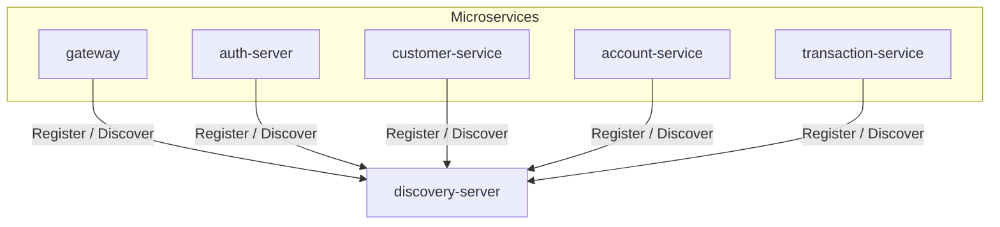

# Discovery Service

[](https://openjdk.org/)
[](https://spring.io/projects/spring-boot)

Service registry and discovery microservice for the Amerbank banking platform.

## Overview

The Discovery Service provides service registry and discovery capabilities using Netflix Eureka.
All microservices register themselves with the discovery server, enabling dynamic service
discovery without hardcoded URLs.



This diagram shows how all microservices register with and discover each other through the
Discovery Service.

**Flow:**

1. All microservices start and register with Eureka
2. Each service sends periodic heartbeats to remain active
3. Services discover other services by querying Eureka
4. If a service goes down, Eureka removes it from the registry

**Discovery Service is used by:**

- **All microservices** - For service registration and discovery

## Features

- Netflix Eureka Server for service registry
- Dynamic service discovery
- Health monitoring via heartbeats
- Load balancing support for client-side service discovery

## Technology Stack

| Category          | Technology                        |
|-------------------|-----------------------------------|
| Framework         | Spring Boot 3.4.4                 |
| Language          | Java 21                           |
| Service Registry  | Netflix Eureka Server             |
| Cloud             | Spring Cloud 2024.0.0             |

## Getting Started

### Prerequisites

- Java 21

### Running the System

#### Local Development
1. Set `amerbank-micro` as your current directory

2. Start the infrastructure services:
   ```bash
   docker-compose up config-server discovery-server
   ```

3. Set `discovery` as your current directory

4. Start the application:
   ```bash
   ./mvnw spring-boot:run
   ```

The service runs on **port 8761**.

#### Docker Deployment

From the project root, run:

```bash
docker-compose up
```

This starts all services with pre-configured settings.

## Eureka Dashboard

The Eureka dashboard provides a web interface to view all registered services.

**Access:**
```
http://localhost:8761
```

The dashboard shows:
- All registered services
- Instance status (UP/DOWN)
- Instance information (hostname, port, etc.)

## Related Services

- **auth-server** (port 8081) - Authentication and authorization
- **customer-service** (port 8082) - Customer profile management
- **account-service** (port 8083) - Account management and balance operations
- **gateway** (port 8080) - API Gateway
- **transaction-service** (port 8084) - Transaction handling
- **config-server** - Centralized configuration

