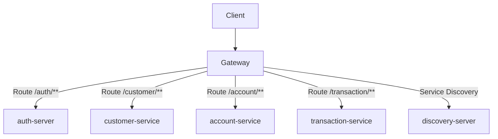

# API Gateway

[](https://openjdk.org/)
[](https://spring.io/projects/spring-boot)
[](https://spring.io/projects/spring-cloud)

API Gateway microservice for the Amerbank banking platform.

## Overview

The API Gateway serves as the single entry point for all client requests. It handles routing,
authentication, and authorization before forwarding requests to the appropriate microservices.
The gateway uses Spring Cloud Gateway with JWT-based authentication.



This diagram shows how the Gateway routes requests to the appropriate microservices based on the URL path.

**Flow:**

1. Client sends request to Gateway (port 8080)
2. Gateway validates JWT token (except for public paths)
3. Gateway extracts user information and adds headers for downstream services
4. Gateway routes request to the appropriate microservice via service discovery
5. Microservice processes request and returns response
6. Gateway forwards response back to client

**Gateway is used by:**

- **All clients** - Web, mobile, or external services accessing the API

## Features

- JWT token validation and authentication
- Role-based access control routing
- Service discovery integration (Eureka)
- Circuit breaker support (Resilience4j)
- Load balancing
- Request routing based on URL paths
- X-User-Id, X-Roles, X-Customer-Id header propagation

## Technology Stack

| Category          | Technology                |
|-------------------|---------------------------|
| Framework         | Spring Boot 3.4.4         |
| Language          | Java 21                   |
| Gateway           | Spring Cloud Gateway      |
| Service Discovery | Netflix Eureka Client     |
| Security          | JWT (jjwt)                |
| Load Balancing    | Spring Cloud Loadbalancer |

## Getting Started

### Prerequisites

- Java 21
- Docker (optional)

### Environment Variables

Create a `.env` file or set these environment variables:

```bash
JWT_SECRET=your_256_bit_minimum_secret_key
```

### Running the System

#### Local Development

1. Set `amerbank-micro` as your current directory

2. Start the infrastructure services:
   ```bash
   docker-compose up config-server discovery-server
   ```

3. Set `gateway` as your current directory

4. Start the application:
   ```bash
   ./mvnw spring-boot:run
   ```

The service runs on **port 8080**.

#### Docker Deployment

From the project root, run:

```bash
docker-compose up
```

This starts all services with pre-configured settings.

## Authentication

The Gateway handles JWT authentication for all protected routes.

### Public Paths

Public paths that don't require authentication are configured in the gateway configuration:

```yaml
gateway:
  public-paths:
    - /auth/login
    - /auth/register
    - /auth/admin/login
    - /auth/admin/register
    - /actuator/health
```

### Request Flow

1. Client sends request with JWT token:
   ```
   Authorization: Bearer <token>
   ```

2. Gateway validates the token

3. Gateway extracts user information and adds headers for downstream services:
   ```
   X-User-Id: 123
   X-Roles: ROLE_USER,ROLE_ADMIN
   X-Customer-Id: 456
   ```

4. Gateway routes request to the appropriate microservice

## Route Configuration

| Path              | Service             | Description              |
|-------------------|---------------------|--------------------------|
| `/auth/**`        | auth-server         | Authentication endpoints |
| `/customer/**`    | customer-service    | Customer management      |
| `/account/**`     | account-service     | Account management       |
| `/transaction/**` | transaction-service | Transaction processing   |
| `/actuator/**`    | gateway             | Health and monitoring    |

## Health Check

| Method | Endpoint           | Description           |
|--------|--------------------|-----------------------|
| GET    | `/actuator/health` | Service health status |

## Example Requests

All requests to microservices should go through the gateway at **localhost:8080**.

### Login

```bash
curl -X POST http://localhost:8080/auth/login \
  -H "Content-Type: application/json" \
  -d '{
    "email": "user@example.com",
    "password": "yourpassword"
  }'
```

### Get Customer Profile

```bash
curl -X GET http://localhost:8080/customer/me \
  -H "Authorization: Bearer <token>"
```

### Create Account

```bash
curl -X POST http://localhost:8080/account/register \
  -H "Content-Type: application/json" \
  -H "Authorization: Bearer <token>" \
  -d '{
    "type": "CHECKING"
  }'
```

### Deposit Funds

```bash
curl -X POST http://localhost:8080/transaction/deposit \
  -H "Content-Type: application/json" \
  -H "Authorization: Bearer <token>" \
  -H "idempotency-key: dep-abc123" \
  -d '{
    "accountNumber": "ACC-XXXX-XXXX-XXXX",
    "amount": 500.00
  }'
```

## Security

- JWT tokens are validated using HS256 algorithm
- Invalid or missing tokens result in 401 Unauthorized
- User information is extracted and passed to downstream services via headers
- Public paths bypass authentication
- Service-to-service calls use internal authentication

## Related Services

- **auth-server** (port 8081) - Authentication and authorization
- **customer-service** (port 8082) - Customer profile management
- **account-service** (port 8083) - Account management
- **transaction-service** (port 8084) - Transaction handling
- **discovery-service** (port 8761) - Service discovery
- **config-server** (port 8888) - Centralized configuration
