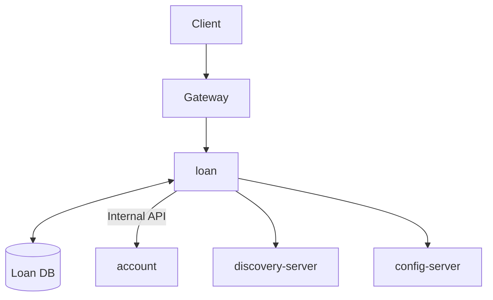

# Loan Service

[](https://openjdk.org/)
[](https://spring.io/projects/spring-boot)
[](https://www.postgresql.org/)

Loan management microservice for the Amerbank banking platform.

## Overview

The Loan Service handles the full loan lifecycle including application, approval, disbursement,
and repayment tracking for the Amerbank microservices architecture. It integrates with the
account-service to verify account ownership and process fund disbursements and repayments.
The service supports multiple loan types with automatic amortization schedule generation.



This diagram represents interactions with the Loan Service. The loan-service manages the complete
loan lifecycle, coordinating with the account-service for fund disbursements and repayments.

**Flow:**

1. Client authenticates via `/auth/login`
2. Auth Server returns a JWT token
3. Client applies for a loan with account details
4. Loan service verifies account ownership via account-service
5. Admin approves or rejects the loan
6. On approval, admin disburses funds — loan service deposits principal to customer's account via account-service
7. Customer makes repayments — loan service withdraws from customer's account via account-service

**Loan Service depends on:**

- **account-service**: for account ownership verification, fund disbursements, and repayment withdrawals

## Features

- Role-based access control (ROLE_USER, ROLE_ADMIN)
- Loan types: PERSONAL, HOME, AUTO, BUSINESS
- Loan statuses: PENDING, APPROVED, REJECTED, ACTIVE, PAID_OFF
- Payment statuses: PENDING, PAID, OVERDUE, WAIVED
- Automatic amortization schedule generation on disbursement
- Account ownership verification before loan application
- One active/pending loan per customer constraint
- Admin loan lifecycle management (approve, reject, disburse)
- Customer self-service loan application and repayment
- Service-to-service internal endpoints for inter-microservice communication
- Pessimistic locking for concurrent-safe loan and payment updates
- Configurable loan number generation (format: `LN-XXXXXXXXXX`)

## Technology Stack

| Category          | Technology                        |
|-------------------|-----------------------------------|
| Framework         | Spring Boot 3.4.13                |
| Language          | Java 21                           |
| Database          | PostgreSQL with Flyway migrations |
| Security          | Spring Security + JWT (jjwt)      |
| Service Discovery | Eureka Client                     |
| Configuration     | Spring Cloud Config               |
| API Docs          | SpringDoc OpenAPI 2.8.15          |
| Testing           | JUnit 5, Mockito, Testcontainers  |

## Getting Started

### Prerequisites

- Java 21
- PostgreSQL (create database named `amerbank`)
- Docker (optional)

### Environment Variables

Set these environment variables:

```bash
DB_USERNAME=your_db_username
DB_PASSWORD=your_db_password
JWT_SECRET=your_256_bit_minimum_secret_key
```

### Running the System

#### Local Development

1. Set `amerbank-micro` as your current directory

2. Start the infrastructure services:
   ```bash
   docker-compose up config-server discovery-server
   ```

3. Create the `amerbank` database in PostgreSQL

4. Set `loan` as your current directory

5. Run migrations:
   ```bash
   ./mvnw flyway:migrate
   ```

6. Start the application:
   ```bash
   ./mvnw spring-boot:run
   ```

The service runs on **port 8086**.

#### Docker Deployment

From the project root, run:

```bash
docker-compose up
```

This starts all services (config-server, discovery-server, loan-service, and other microservices) with pre-configured
settings.

## Authentication

To access protected endpoints:

1. Obtain a JWT via `/auth/login` on auth-server
2. Include it in the Authorization header:
   ```
   Authorization: Bearer <token>
   ```

**Roles:**

- `ROLE_USER` - Standard customer access (apply for loans, view own loans, make repayments)
- `ROLE_ADMIN` - Administrative access (approve, reject, disburse loans, view all loans)

**Internal Services:**
Internal service-to-service calls must include the `SCOPE_service` claim in the JWT.
The loan service accepts service tokens issued by `account-service` and `customer-service`
with audience `loan-service`.

## API Documentation (Swagger)

This service provides interactive API documentation using **Swagger UI**, allowing you to explore and test endpoints
directly from the browser.

### Access Swagger UI

http://localhost:8086/swagger-ui/index.html#/

---

### Authentication on Swagger

Most endpoints require a **JWT token**.

1. Authenticate using `/auth/login`
2. Copy the returned token
3. Click **Authorize** in Swagger UI
4. Enter the token copied

## API Endpoints

### Protected Endpoints (User)

| Method | Endpoint                         | Description                        |
|--------|----------------------------------|------------------------------------|
| POST   | `/loan/apply`                    | Apply for a new loan               |
| GET    | `/loan/me`                       | Get all loans for current customer |
| GET    | `/loan/me/{loanNumber}`          | Get loan details by loan number    |
| GET    | `/loan/me/{loanNumber}/payments` | Get payment schedule for a loan    |
| POST   | `/loan/repay`                    | Make a loan repayment              |

### Protected Endpoints (Admin)

| Method | Endpoint                            | Description                      |
|--------|-------------------------------------|----------------------------------|
| GET    | `/loan/admin/all`                   | Get all loans                    |
| GET    | `/loan/admin/{loanNumber}`          | Get loan by loan number          |
| POST   | `/loan/admin/approve`               | Approve a pending loan           |
| POST   | `/loan/admin/reject`                | Reject a pending loan            |
| POST   | `/loan/admin/disburse`              | Disburse funds for approved loan |
| GET    | `/loan/admin/customer/{customerId}` | Get all loans for a customer     |

### Internal Endpoints (Service-to-Service)

| Method | Endpoint                                      | Description                        |
|--------|-----------------------------------------------|------------------------------------|
| GET    | `/loan/internal/{loanNumber}`                 | Get loan details by number         |
| POST   | `/loan/internal/disburse`                     | Disburse loan funds to account     |
| POST   | `/loan/internal/repay`                        | Process loan repayment internally  |
| GET    | `/loan/internal/customer/{customerId}/active` | Check if customer has active loans |

## Health Check

| Method | Endpoint           | Description           |
|--------|--------------------|-----------------------|
| GET    | `/actuator/health` | Service health status |

## Example Requests & Responses

All requests should be made through the gateway at **localhost:8080**

### Apply for a Loan

**Request:**

```bash
curl -X POST http://localhost:8080/loan/apply \
  -H "Content-Type: application/json" \
  -H "Authorization: Bearer <token>" \
  -d '{
    "type": "PERSONAL",
    "principalAmount": 50000.00,
    "interestRate": 5.5,
    "termMonths": 60,
    "accountNumber": "ACC-XXXX-XXXX-XXXX"
  }'
```

**Response:**

```json
{
  "id": "550e8400-e29b-41d4-a716-446655440000",
  "loanNumber": "LN-1234567890",
  "customerId": 1,
  "accountNumber": "ACC-XXXX-XXXX-XXXX",
  "principalAmount": 50000.00,
  "interestRate": 5.5,
  "termMonths": 60,
  "monthlyPayment": 955.06,
  "totalAmount": 57303.60,
  "remainingBalance": 57303.60,
  "type": "PERSONAL",
  "status": "PENDING",
  "disbursedAt": null,
  "maturityDate": null
}
```

### Get My Loans

**Request:**

```bash
curl -X GET http://localhost:8080/loan/me \
  -H "Authorization: Bearer <token>"
```

**Response:**

```json
[
  {
    "id": "550e8400-e29b-41d4-a716-446655440000",
    "loanNumber": "LN-1234567890",
    "principalAmount": 50000.00,
    "remainingBalance": 45000.00,
    "type": "PERSONAL",
    "status": "ACTIVE",
    "monthlyPayment": 955.06
  }
]
```

## Error Handling

The API returns standard error responses:

```json
{
  "timestamp": "2026-02-21T10:30:00",
  "status": 404,
  "error": "Not Found",
  "message": "Loan not found",
  "path": "/loan/me/LN-1234567890",
  "traceId": "550e8400-e29b-41d4-a716-446655440000"
}
```

**Common HTTP Status Codes:**

| Status | Description           |
|--------|-----------------------|
| 200    | Success               |
| 201    | Created               |
| 400    | Validation error      |
| 401    | Unauthorized          |
| 403    | Forbidden             |
| 404    | Not found             |
| 409    | Conflict              |
| 500    | Internal server error |
| 503    | Service unavailable   |

**Loan-Specific Errors:**

- `400` - Loan not eligible for the requested operation
- `400` - Repayment amount less than monthly payment
- `400` - Loan not approved for disbursement
- `403` - Loan does not belong to the authenticated customer
- `409` - Customer already has an active or pending loan
- `500` - Loan disbursement failed (account service error)
- `500` - Loan repayment failed (account service error)
- `500` - Unable to generate unique loan number
- `503` - Account service unavailable

## Loan Lifecycle

```
PENDING --[admin approve]--> APPROVED --[admin disburse]--> ACTIVE --[full repayment]--> PAID_OFF
PENDING --[admin reject]---> REJECTED
```

- **PENDING**: Initial state after loan application. Awaiting admin review.
- **APPROVED**: Admin has approved the loan. Awaiting disbursement.
- **REJECTED**: Admin has rejected the loan with a reason.
- **ACTIVE**: Funds disbursed to customer's account. Payment schedule generated. Repayments in progress.
- **PAID_OFF**: Remaining balance reached zero. All payments completed.

## Security

- JWT tokens are validated using HS256 algorithm
- Two authentication chains: customer-facing and service-to-service
- Internal endpoints require `SCOPE_service` claim in JWT
- Service tokens accepted from `account-service` and `customer-service` issuers
- Role-based access control for user vs admin operations
- Pessimistic locking for concurrent-safe loan and payment updates
- One active/pending loan per customer constraint
- Account ownership verified before loan application

## Testing

```bash
# Run unit tests
./mvnw test

# Run all tests including integration
./mvnw verify

# Run specific test class
./mvnw test -Dtest=LoanServiceTest
```

## Project Structure

```
src/main/java/com/amerbank/loan/
├── controller/      # REST endpoints (User, Admin, Internal)
├── service/         # Business logic + mapper
├── model/           # JPA entities (Loan, LoanPayment)
├── dto/             # Data transfer objects (requests, responses)
├── repository/      # Data access (Spring Data JPA)
├── exception/       # Custom exceptions
├── security/        # JWT, filters, config
├── client/          # Account service REST client
├── config/          # Application configuration
└── util/            # Utilities (TraceIdUtil)
```

## Related Services

- **auth-server** (port 8081) - Authentication and authorization
- **customer-service** (port 8082) - Customer profile management
- **account-service** (port 8083) - Account management and balance operations
- **transaction-service** (port 8084) - Transaction handling
- **audit-logging** (port 8085) - Audit event ingestion
- **gateway** (port 8080) - API Gateway
- **discovery** (port 8761) - Eureka Service Discovery
- **config-server** - Centralized configuration
