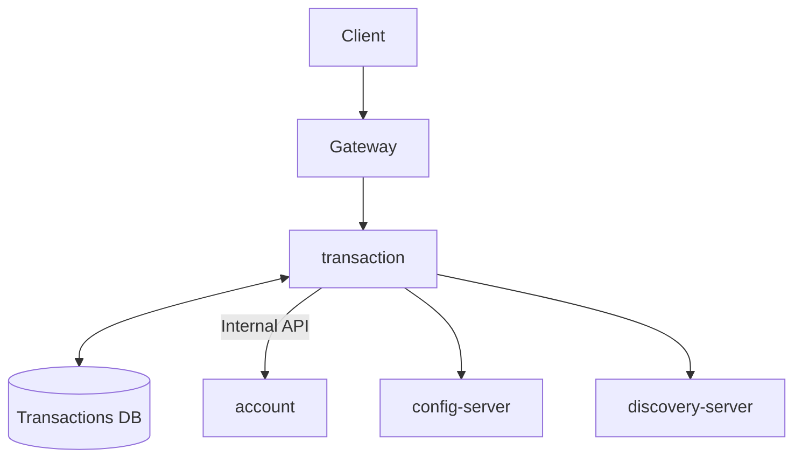

# Transaction Service

[](https://openjdk.org/)
[](https://spring.io/projects/spring-boot)
[](https://www.postgresql.org/)

Transaction management microservice for the Amerbank banking platform.

## Overview

The Transaction Service handles all banking transaction operations including deposits,
payments, and refunds. It orchestrates transactions by coordinating with the account-service
to verify account ownership and execute balance modifications. All operations support
idempotency to prevent duplicate processing.



This diagram represents the transaction flow. The transaction-service acts as an orchestrator,
validating requests, verifying account ownership, creating transaction records, and
coordinating with the account-service for balance updates.

**Flow:**

1. Client authenticates via `/auth/login`
2. Auth Server returns a JWT token
3. Client submits transaction with unique `idempotency-key` header
4. Transaction service verifies account ownership via account-service
5. Transaction service creates transaction record and calls account-service
6. Account service updates balances internally

**Transaction Service depends on:**

- **account-service**: for account ownership verification and balance operations

## Features

- Role-based access control (ROLE_USER, ROLE_ADMIN)
- Transaction types: DEPOSIT, WITHDRAWAL, TRANSFER, PAYMENT, REFUND
- Transaction status: APPROVED, WAITING, FAILED, REVERSED
- Idempotency support - prevents duplicate transactions
- Account ownership verification before operations
- Rich transaction filtering by account, status, and type
- Transaction reversal support (refunds)

## Technology Stack

| Category          | Technology                        |
|-------------------|-----------------------------------|
| Framework         | Spring Boot 3.4.4                 |
| Language          | Java 21                           |
| Database          | PostgreSQL with Flyway migrations |
| Security          | Spring Security + JWT (jjwt)      |
| Service Discovery | Eureka Client                     |
| Configuration     | Spring Cloud Config               |
| Testing           | JUnit 5, Mockito, Testcontainers  |

## Getting Started

### Prerequisites

- Java 21
- PostgreSQL (create database named `amerbank`)
- Docker (optional)

### Environment Variables

Create a `.env` file or set these environment variables:

```bash
DB_USERNAME=your_db_username
DB_PASSWORD=your_db_password
JWT_SECRET=your_256_bit_minimum_secret_key
```

### Running the System

#### Local Development

1. Set `amerbank-micro` as your current directory

2. Start the infrastructure services:
   ```bash
   docker-compose up config-server discovery-server
   ```

3. Create the `amerbank` database in PostgreSQL

4. Set `transaction` as your current directory

5. Run migrations:
   ```bash
   ./mvnw flyway:migrate
   ```

6. Start the application:
   ```bash
   ./mvnw spring-boot:run
   ```

The service runs on **port 8084**.

#### Docker Deployment

From the project root, run:

```bash
docker-compose up
```

This starts all services (config-server, discovery-server, transaction-service, and other microservices) with
pre-configured settings.

## Authentication

To access protected endpoints:

1. Obtain a JWT via `/auth/login` on auth-server
2. Include it in the Authorization header:
   ```
   Authorization: Bearer <token>
   ```

**Roles:**

- `ROLE_USER` - Standard customer access (view own transactions, create transactions)
- `ROLE_ADMIN` - Administrative access (view all transactions)

**Important:**
All transaction endpoints require an `idempotency-key` header with a unique value.
This prevents duplicate transactions when retrying requests.

## API Endpoints

### Protected Endpoints (User)

| Method | Endpoint                                        | Description                        |
|--------|-------------------------------------------------|------------------------------------|
| GET    | `/transaction/me?accountNumber=`                | Get all transactions for account   |
| GET    | `/transaction/me/from?fromAccountNumber=`       | Get transactions by source account |
| GET    | `/transaction/me/to?toAccountNumber=`           | Get transactions by destination    |
| GET    | `/transaction/me/transfer`                      | Get transfers between accounts     |
| GET    | `/transaction/me/status?accountNumber=&status=` | Get transactions by status         |
| GET    | `/transaction/me/type?accountNumber=&type=`     | Get transactions by type           |
| POST   | `/transaction/deposit`                          | Create deposit (idempotent)        |
| POST   | `/transaction/payment`                          | Create payment (idempotent)        |
| POST   | `/transaction/refund`                           | Create refund (idempotent)         |

### Protected Endpoints (Admin)

| Method | Endpoint                                     | Description                  |
|--------|----------------------------------------------|------------------------------|
| GET    | `/transaction/admin/{id}`                    | Get transaction by ID        |
| GET    | `/transaction/admin?fromAccount=`            | Query by source account      |
| GET    | `/transaction/admin?toAccount=`              | Query by destination account |
| GET    | `/transaction/admin?fromAccount=&toAccount=` | Query by both accounts       |
| GET    | `/transaction/admin?status=`                 | Query by status              |
| GET    | `/transaction/admin?type=`                   | Query by type                |

## Health Check

| Method | Endpoint           | Description           |
|--------|--------------------|-----------------------|
| GET    | `/actuator/health` | Service health status |

## Example Requests & Responses

All requests should be made through the gateway at **localhost:8080**.

### Deposit Funds

**Request:**

```bash
curl -X POST http://localhost:8080/transaction/deposit \
  -H "Content-Type: application/json" \
  -H "Authorization: Bearer <token>" \
  -H "idempotency-key: dep-abc123" \
  -d '{
    "accountNumber": "ACC-XXXX-XXXX-XXXX",
    "amount": 500.00
  }'
```

**Response:**

```json
{
  "id": "tx-12345",
  "amount": 500.00,
  "fromAccountNumber": null,
  "toAccountNumber": "ACC-XXXX-XXXX-XXXX",
  "type": "DEPOSIT",
  "status": "APPROVED",
  "failureReason": null,
  "idempotencyKey": "dep-abc123",
  "createdAt": "2026-02-22T10:30:00"
}
```

### Make a Payment

**Request:**

```bash
curl -X POST http://localhost:8080/transaction/payment \
  -H "Content-Type: application/json" \
  -H "Authorization: Bearer <token>" \
  -H "idempotency-key: pay-xyz789" \
  -d '{
    "fromAccountNumber": "ACC-XXXX-XXXX-XXXX",
    "toAccountNumber": "ACC-YYYY-YYYY-YYYY",
    "amount": 100.00
  }'
```

**Response:**

```json
{
  "id": "tx-67890",
  "amount": 100.00,
  "fromAccountNumber": "ACC-XXXX-XXXX-XXXX",
  "toAccountNumber": "ACC-YYYY-YYYY-YYYY",
  "type": "PAYMENT",
  "status": "APPROVED",
  "failureReason": null,
  "idempotencyKey": "pay-xyz789",
  "createdAt": "2026-02-22T11:00:00"
}
```

### Get My Transactions

**Request:**

```bash
curl -X GET "http://localhost:8080/transaction/me?accountNumber=ACC-XXXX-XXXX-XXXX" \
  -H "Authorization: Bearer <token>"
```

**Response:**

```json
[
  {
    "id": "tx-12345",
    "amount": 500.00,
    "fromAccountNumber": null,
    "toAccountNumber": "ACC-XXXX-XXXX-XXXX",
    "type": "DEPOSIT",
    "status": "APPROVED",
    "failureReason": null,
    "idempotencyKey": "dep-abc123",
    "createdAt": "2026-02-22T10:30:00"
  },
  {
    "id": "tx-67890",
    "amount": 100.00,
    "fromAccountNumber": "ACC-XXXX-XXXX-XXXX",
    "toAccountNumber": "ACC-YYYY-YYYY-YYYY",
    "type": "PAYMENT",
    "status": "APPROVED",
    "failureReason": null,
    "idempotencyKey": "pay-xyz789",
    "createdAt": "2026-02-22T11:00:00"
  }
]
```

### Refund a Transaction

**Request:**

```bash
curl -X POST http://localhost:8080/transaction/refund \
  -H "Content-Type: application/json" \
  -H "Authorization: Bearer <token>" \
  -H "idempotency-key: ref-refund123" \
  -d '{
    "transactionId": "tx-67890"
  }'
```

**Response:**

```json
{
  "id": "tx-11111",
  "amount": 100.00,
  "fromAccountNumber": "ACC-YYYY-YYYY-YYYY",
  "toAccountNumber": "ACC-XXXX-XXXX-XXXX",
  "type": "REFUND",
  "status": "APPROVED",
  "failureReason": null,
  "idempotencyKey": "ref-refund123",
  "createdAt": "2026-02-22T12:00:00"
}
```

## Error Handling

The API returns standard error responses:

```json
{
  "timestamp": "2026-02-21T10:30:00",
  "status": 404,
  "error": "Not Found",
  "message": "Transaction not found"
}
```

**Common HTTP Status Codes:**
| Status | Description |
|--------|-------------|
| 200 | Success |
| 201 | Created |
| 400 | Bad Request (validation error, idempotency key missing) |
| 401 | Unauthorized (invalid credentials) |
| 403 | Forbidden (insufficient permissions) |
| 404 | Not Found |
| 409 | Conflict (duplicate idempotency key) |
| 500 | Internal Server Error |

**Transaction-Specific Errors:**

- `400` - Missing `idempotency-key` header
- `409` - Duplicate transaction (same idempotency key)
- `404` - Transaction or account not found
- `400` - Transaction already refunded (for refund requests)

## Security

- JWT tokens are validated using HS256 algorithm
- All transaction endpoints require authentication
- Account ownership verified before any transaction operation
- Idempotency keys ensure safe retries without duplicate transactions
- Role-based access control for user vs admin operations

## Testing

```bash
# Run unit tests
./mvnw test

# Run all tests including integration
./mvnw verify

# Run specific test class
./mvnw test -Dtest=TransactionServiceTest
```

## Project Structure

```
src/main/java/com/amerbank/transaction/
├── controller/      # REST endpoints
├── service/        # Business logic
├── model/          # JPA entities
├── dto/            # Data transfer objects
├── repository/     # Data access
├── exception/      # Custom exceptions
├── security/       # JWT, filters, config
├── config/         # Application configuration
└── util/           # Utilities
```

## Related Services

- **auth-server** (port 8081) - Authentication and authorization
- **customer-service** (port 8082) - Customer profile management
- **account-service** (port 8083) - Account management and balance operations
- **gateway** (port 8080) - API Gateway
- **discovery** (port 8761) - Eureka Service Discovery
- **config-server** - Centralized configuration
